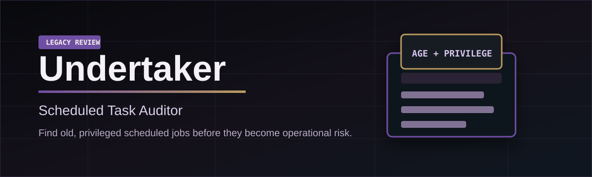

# Undertaker: Legacy Automation Auditor

Find old, privileged scheduled jobs before they become operational risk.

Undertaker is a read-only Python tool for finding scheduled jobs that may be old, privileged, or both.

It audits Linux cron jobs, Linux systemd timers, and Windows Scheduled Tasks, then prints a human-readable table and optionally writes JSON output for later review.

Undertaker's theme is the graveyard shift: dark, serious, and built for bringing old automation back into view. It does not bury anything or swing a hammer; it raises forgotten scheduled jobs into a clean review table so an operator can decide what still belongs.


## At A Glance

- Read-only audit tool; it does not disable or delete tasks.
- Scans Linux cron, Linux systemd timers, and Windows Scheduled Tasks.
- Flags task definitions that are old, privileged, or both.
- Writes human-readable tables and structured JSON.
- Includes filters to reduce Windows baseline noise.
- Can emit JSON to stdout for pipelines.
- Can optionally check whether extracted command paths exist.
- Supports allowlists for known-good scheduled jobs.
- Includes Windows last-run metadata when available.
- Ships with tests, CI, issue templates, a security policy, and versioned releases.

## Graveyard Shift

Undertaker is built around three review questions:

- `What is still scheduled?`
- `How long has it been there?`
- `Does it run with more privilege than expected?`

The output is intentionally plain because the goal is not theater. It is to make forgotten automation visible enough for a human to close, allowlist, or investigate the right work.

## Demo


More screenshots are available in [docs/demo.md](docs/demo.md).

## Why It Exists

Scheduled automation is easy to forget. A task may be created for maintenance, startup behavior, updates, backups, or temporary troubleshooting, then quietly keep running for months or years.

That matters because scheduled jobs can run with elevated privileges such as `root`, `SYSTEM`, or Administrator. An old task with high privileges is not automatically malicious, but it deserves review.

This project helps answer:

> What scheduled automation exists on this machine, how old is it, and does it run with elevated privileges?

## What It Checks

On Linux:

- `/etc/crontab`
- `/etc/cron.d/*`
- User crontab spool locations
- `/etc/cron.hourly`, `/etc/cron.daily`, `/etc/cron.weekly`, and `/etc/cron.monthly`
- systemd timers discovered through `systemctl list-timers`

On Windows:

- Scheduled Tasks through PowerShell `Get-ScheduledTask`
- Task actions, trigger types, principal user, run level, and task definition timestamps

## Suspicion Rules

The auditor flags a task when:

- The task definition is older than the configured threshold, defaulting to 180 days.
- The task appears to run with elevated privileges.

Severity:

- `none`: no flag
- `medium`: old or privileged
- `high`: old and privileged

The flags are triage signals, not proof of compromise.

## Usage

Run directly from a clone:

```bash
python legacy_automation_auditor.py
```

Install as a local CLI from the repository:

```bash
python -m pip install .
undertaker --only-suspicious
```

Check the installed version:

```bash
undertaker --version
```

Use a different age threshold:

```bash
python legacy_automation_auditor.py --days 90
```

Write JSON to a specific file:

```bash
python legacy_automation_auditor.py --output results.json
```

Emit JSON to stdout:

```bash
python legacy_automation_auditor.py --format json --no-json
```

Check whether extracted command paths appear to exist:

```bash
python legacy_automation_auditor.py --check-paths
```

When enabled, missing command paths are flagged as `missing_command_path` and shown in table output.

Suppress known-good tasks with an allowlist:

```bash
python legacy_automation_auditor.py --allowlist examples/allowlist.example.json
```

Skip JSON output:

```bash
python legacy_automation_auditor.py --no-json
```

Show only tasks that were flagged:

```bash
python legacy_automation_auditor.py --only-suspicious
```

Reduce Windows noise by hiding obvious built-in Microsoft tasks:

```bash
python legacy_automation_auditor.py --hide-windows-builtin
```

The script ends with a summary:

```text
Found X tasks, Y suspicious (Z high severity).
```

## Output Fields

JSON output includes each task's platform, type, name, command, run user, owner, schedule, source definition, modified timestamp, age in days, flags, risk reasons, and severity. Windows tasks include last-run metadata when available. When `--check-paths` is used, each task also includes `command_path_exists`.

Severity is intentionally simple:

- `medium`: old or privileged
- `high`: old and privileged

## Example Local Result

On a personal Windows test machine, the auditor found Windows Scheduled Tasks and separated them into review categories. Many built-in Windows tasks were flagged as medium because they run as `SYSTEM` or with the highest run level, which is expected behavior for operating system maintenance tasks.

The point is not to label every privileged task as bad. The point is to make privilege and age visible so a human can review what matters.

## Files

- `legacy_automation_auditor.py`: the scanner CLI
- `docs/design-notes.md`: design notes, implementation details, and limitations
- `docs/demo.md`: screenshots and example output
- `examples/allowlist.example.json`: sample allowlist
- `CHANGELOG.md`: release history

## Limitations

- It does not modify, disable, or delete scheduled tasks.
- It does not prove whether a task is malicious.
- It may miss items the current user cannot read.
- It uses task definition modified time, not necessarily last run time.
- It does not deeply inspect scripts launched by tasks.

## Validation

The script was checked with:

```bash
python -m py_compile legacy_automation_auditor.py
python legacy_automation_auditor.py --no-json
python legacy_automation_auditor.py --format json --no-json
python -m unittest discover -s tests
```
