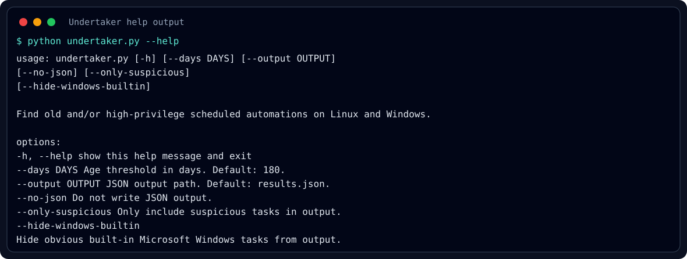
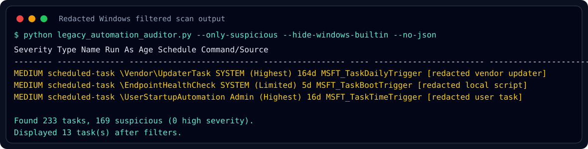

# Demo

These screenshots show Undertaker running from a Windows test machine.

The filtered scan screenshot uses the real command and local summary counts from a real run. Task names and command paths are redacted so the public repository does not expose host-specific software inventory or personal automation names.

## Help Output



## Filtered Windows Scan

Command:

```bash
python legacy_automation_auditor.py --only-suspicious --hide-windows-builtin --no-json
```



The filters reduce noisy built-in Microsoft tasks and leave a shorter review list of third-party or user-created scheduled tasks.

